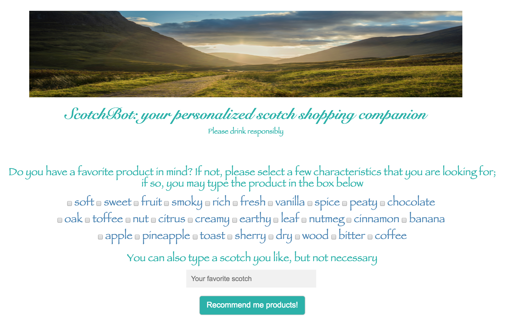
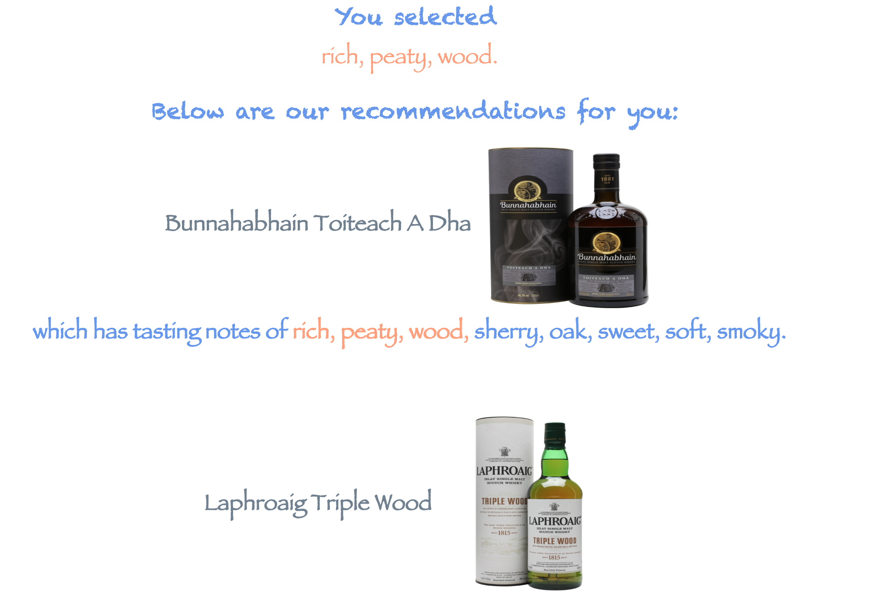

# ScotchBot: a personalized scotch recommender system

Built a hybrid content-based and collaborative filtering system to recommend scotch to users. Model is deployed on an AWS EC2 instance and the [web app](http://yuxinchen.live) is built using Flask.

The system incorporates user-item interaction data and item features, such as tasting notes of scotch products, which are incorporated into the traditional matrix factorization algorithm. Therefore it allows suggesting products to new users once they indicate their tasting preferences and recommendint new products.

Below shows a result

## Methods and packages

* BeautifulSoup for data scraping from [the Whisky Exchange](https://www.thewhiskyexchange.com/)
* Gensim keywords extraction package that utilizes [Textrank](https://web.eecs.umich.edu/~mihalcea/papers/mihalcea.emnlp04.pdf) to extract keywords from scotch customers' reviews and producers' tasting notes
* [nltk](https://www.nltk.org/) for text data preprocessing
* [lightFM](https://github.com/lyst/lightfm) to train the hybrid recommender system. In ScotchBot, WARP ranking loss is used. 
* [Flask](http://flask.pocoo.org/) and [jinja](http://jinja.pocoo.org/) to build the [web app](yuxinchen.live)
* [PostgreSQL](https://www.postgresql.org/)

## Author

**Yuxin Chen** 

Contact: yuxinchen0612 AT gmail DOT com

LinkedIn: yuxin-chen-10

## Acknowledgments

* This project was done during the Insight data science program
